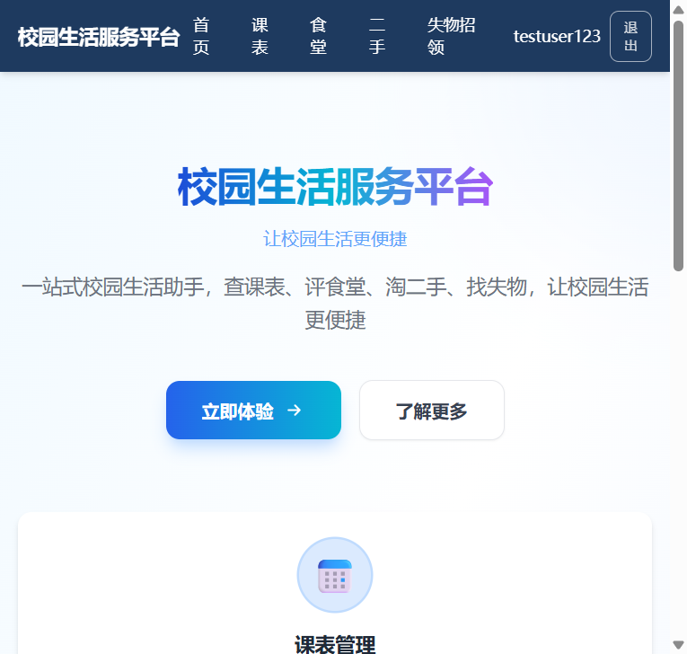
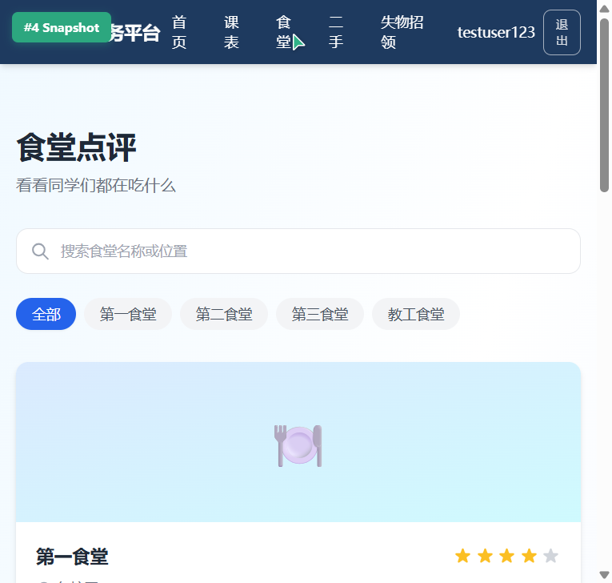
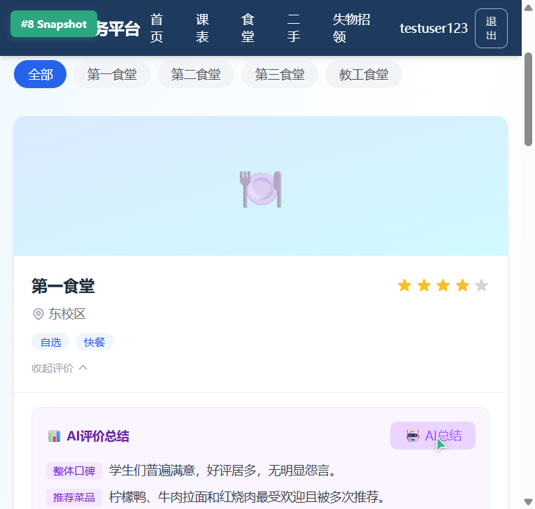
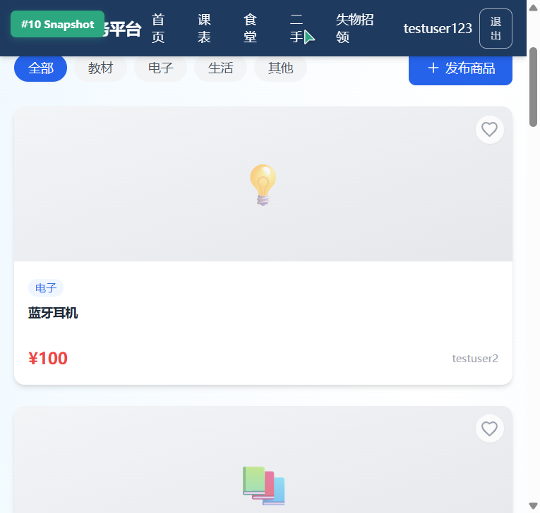
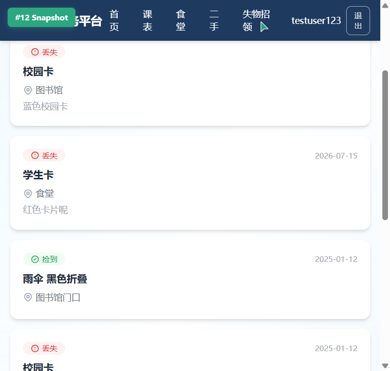
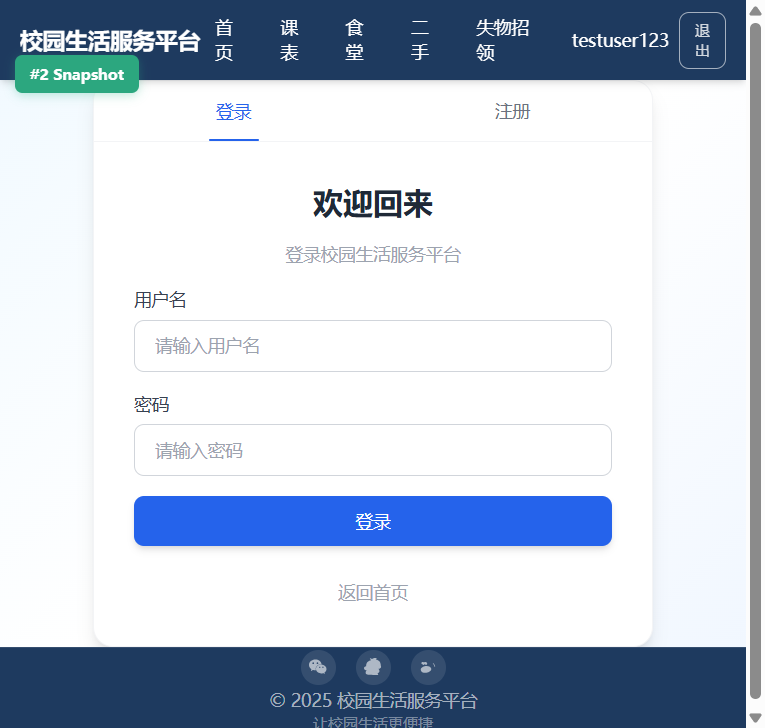
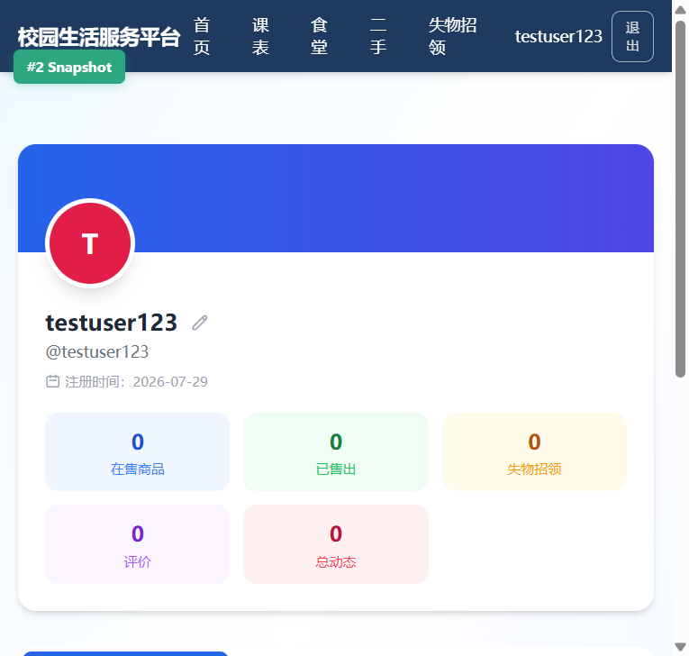

# 校园生活服务平台

一站式校园生活助手，集成课表管理、食堂点评、二手交易、失物招领四大核心模块，让校园生活更便捷高效。

## 功能截图

### 🏠 首页
一站式校园生活入口，集成课表管理、食堂点评、二手交易、失物招领四大核心模块导航。


*首页 - 四大核心模块入口，快速直达校园服务*

### 🍽️ 食堂点评 + AI 总结
浏览食堂信息、查看评价排行、发表用餐体验。AI 智能分析多条评价，自动生成口碑、菜品、价格三方面总结。


*食堂点评页 - 搜索筛选、星级排行与评价展示*


*AI评价总结 - 智能分析食堂评价，一键获取口碑摘要*

### 🔄 二手交易 + AI 描述
校园闲置物品买卖，支持分类筛选、关键词搜索。AI 根据商品名称和价格自动生成生动描述，省去手动编辑的麻烦。


*二手交易页 - 商品列表、分类筛选与 AI 描述生成按钮*

### 🔍 失物招领
发布和查找遗失物品，支持按类型（丢失/捡到）筛选和关键词搜索，帮助同学快速找回失物。


*失物招领页 - 信息发布、类型筛选与列表展示*

### 🔐 登录注册
JWT 认证系统，支持用户注册和登录，Token 自动存储，保障账户安全。


*登录/注册页 - 表单验证与 Token 安全认证*

### 👤 个人中心
查看个人信息与统计数据，管理已发布的二手商品和失物招领记录，支持修改昵称、账号退出与切换。


*个人中心 - 用户信息、统计概览与发布管理*

---

## 技术栈

### 前端
| 技术 | 版本 | 用途 |
|------|------|------|
| React | 19 | 前端 UI 框架 |
| TypeScript | 6 | 类型安全开发 |
| Vite | 8 | 构建工具 |
| Tailwind CSS | 3 | 样式框架 |
| React Router DOM | 7 | 前端路由 |

### 后端
| 技术 | 版本 | 用途 |
|------|------|------|
| Express | 5 | Web 服务框架 |
| SQLite (sql.js) | 1.14 | 数据库 |
| JWT (jsonwebtoken) | 9 | 用户认证 |
| bcryptjs | 3 | 密码加密 |
| DeepSeek API | - | AI 功能集成 |

### 部署
| 平台 | 用途 |
|------|------|
| Railway | 后端 API + 前端静态文件（同域部署） |
| Vercel | 前端部署（备用） |

---

## 部署链接

### 主入口（推荐）
- **前端 + 后端一体化**：https://feisty-reflection-production-8765.up.railway.app
- **后端 API 示例**：https://feisty-reflection-production-8765.up.railway.app/api/canteens

### 备用入口
- **Vercel 前端**：https://my-campus-app.vercel.app

### GitHub 仓库
- **仓库地址**：https://github.com/yy720-yeye/my-campus-app

---

## 本地运行

### 环境要求
- Node.js >= 22
- npm >= 10

### 1. 克隆项目

```bash
git clone https://github.com/yy720-yeye/my-campus-app.git
cd my-campus-app
```

### 2. 安装依赖

```bash
npm install
```

### 3. 配置环境变量

创建 `.env` 文件（项目根目录已提供）：

```env
# 后端 API 地址（开发环境通过 Vite proxy 转发，留空即可）
VITE_API_BASE=

# DeepSeek API 配置（用于 AI 功能）
DEEPSEEP_API_KEY=your_api_key_here
DEEPSEEK_API_BASE=https://api.deepseek.com
```

创建 `server/.env` 文件：

```env
PORT=3001
JWT_SECRET=your_jwt_secret_here
CAMPUS_DB_PATH=./server/database/campus.db
```

### 4. 启动开发服务器

**同时启动前端和后端：**

```bash
# 终端 1：启动后端
npm run server

# 终端 2：启动前端开发服务器
npm run dev
```

前端开发服务器运行在 http://localhost:5174，后端 API 运行在 http://localhost:3001。

### 5. 生产构建

```bash
npm run build
npm start
```

生产环境下，后端 Express 自动托管前端静态文件，访问 http://localhost:3001 即可使用。

---

## 项目结构

```
my-campus-app/
├── public/                # 静态资源
├── server/                # 后端服务
│   ├── database/          # 数据库连接与初始化
│   ├── middleware/         # JWT 认证中间件
│   ├── routes/            # API 路由
│   │   ├── auth.js        # 用户认证（注册/登录/用户信息）
│   │   ├── canteens.js    # 食堂接口
│   │   ├── reviews.js     # 评价接口
│   │   ├── items.js       # 二手商品接口
│   │   ├── lost-found.js  # 失物招领接口
│   │   └── ai.js          # AI 总结接口
│   └── index.js           # 服务入口
├── src/                   # 前端源码
│   ├── api/               # API 常量
│   ├── components/        # 组件（Navbar, Layout, Footer, 表单等）
│   ├── config/            # API 配置与请求工具
│   ├── pages/             # 页面组件
│   │   ├── HomePage.tsx   # 首页
│   │   ├── CanteenPage.tsx# 食堂点评
│   │   ├── TradePage.tsx  # 二手交易
│   │   ├── LostFoundPage.tsx # 失物招领
│   │   ├── AuthPage.tsx   # 登录注册
│   │   ├── SchedulePage.tsx # 课表管理（占位）
│   │   └── ProfilePage.tsx # 个人中心（占位）
│   ├── App.tsx            # 路由配置
│   └── main.tsx           # 入口文件
├── screenshots/           # 功能截图
├── verification-screenshots/ # 验证截图
├── package.json
├── vite.config.ts
├── tailwind.config.js
├── nixpacks.toml          # Railway 构建配置
└── railway.json           # Railway 部署配置
```

---

## API 接口一览

| 方法 | 路径 | 认证 | 说明 |
|------|------|:----:|------|
| POST | `/api/auth/register` | 否 | 用户注册 |
| POST | `/api/auth/login` | 否 | 用户登录 |
| GET | `/api/auth/me` | 是 | 获取当前用户信息 |
| GET | `/api/canteens` | 否 | 获取食堂列表 |
| GET | `/api/reviews` | 否 | 获取评价列表（支持分页） |
| POST | `/api/reviews` | 是 | 提交评价 |
| PUT | `/api/reviews/:id` | 是 | 修改评价 |
| DELETE | `/api/reviews/:id` | 是 | 删除评价 |
| GET | `/api/items` | 否 | 获取商品列表（支持搜索/分类） |
| POST | `/api/items` | 是 | 发布商品 |
| PUT | `/api/items/:id` | 是 | 修改商品 |
| DELETE | `/api/items/:id` | 是 | 下架商品 |
| GET | `/api/lost-found` | 否 | 获取失物招领列表 |
| POST | `/api/lost-found` | 是 | 发布信息 |
| PUT | `/api/lost-found/:id` | 是 | 修改信息 |
| DELETE | `/api/lost-found/:id` | 是 | 删除信息 |
| POST | `/api/ai/summarize-reviews` | 否 | AI 评价总结 |
| POST | `/api/ai/generate-item-description` | 否 | AI 生成商品描述 |

所有接口统一响应格式：`{ code: number, data: unknown, message: string }`

---

## 数据库

使用 SQLite 数据库（sql.js），包含 6 张表：

| 表名 | 说明 |
|------|------|
| `users` | 用户信息 |
| `courses` | 课表数据（预留） |
| `canteens` | 食堂信息 |
| `reviews` | 用餐评价 |
| `items` | 二手商品 |
| `lost_found` | 失物招领 |

---

## 许可证

MIT License